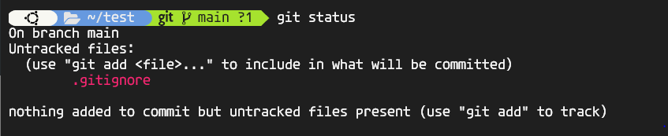

# git-study-chaerim

📓LikeLion KWU git study (chaerim) <br>
모든 개발의 기본인 <strong>git, github 강의</strong> 내용정리 입니다.

<hr>
<br>

## 1. Git & Github 등장과 역할

- 코드를 관리하는 도구, 개발시 버전관리, 협업<br>
- SCM이 등장해 저장소에 저장된 소스의 **변경사항**과 **작업자**를 추적, git과 Github가 대표적 도구<br>
- Git : 소스 이력 추적을 위한 버전 관리 시스템<br>
- Github : git 프로젝트를 관리하는 저장소 제공<br>

<br>

## 2. Git 설치 및 세팅하기 - 윈도우

git scm으로 64-bit 설치<br>

```bash
#사용자 등록
git config --global user.name "<이름>"
git config --global user.email "<이메일 주소>"

#사용자 계정 확인
git config --list

#q버튼 눌러서 빠져나오기
```


<br>

## 3. Git의 동작 흐름과 구성 요소

- Working Directory : 현재 작업중인 디렉토리<br>
- Staging Area :commit할 파일의 예비 저장소<br>
- Local Repository : 각 컴퓨터의 git이 관리하는 로컬 저장소 - 눈에 보이지 않음, 언제든지 commit한 지점으로 돌아감<br>
- Remote Repository : Github 등 외부에 위치한 원격 저장소<br>

<br>

## 4. 로컬 Git 저장소 생성

```bash
#Step1 - 로컬 작업 폴더 초기화, .git 생성
#내 프로젝트가 위치한 곳으로 이동 후 터미널 명령 실행
git init

#Step2 - .gitignore 파일추가
#민감한 정보는 git에 올라가지 않게하자.
#여기에 쓴 파일 이름은 git에서 무시

#Step3 - 현재 추적되는 파일 확인
git status

#Step4 - 버전관리에 반영할 파일 추가
git add .
git add "<파일명>"
#로컬에서 add하면 staging area에 반영
#잘못 add하면 git rm/rmset으로 되돌리자.

#Step5 - 버전 메세지 남기기
git commit -m "<message>"
#Staging area에서 commit해 로컬에 남김

#Step6 - 현재 브랜치 이름 main으로 설정
git branch -M main
#main/master 브랜치 : 즉시 운영배포할 수 있는 버전, 사용자가 지금 이용중인 코드
#staging 브랜치 : 상용에 반영하기 전 테스트 버전
#feature : 새로운 기능 추가 개발 (병렬 작업)
```

<br>

## 5. 로컬 Git 저장소 생성 실습

1. mkdir로 디렉토리 생성, echo로 txt파일 생성

   

2. init후 ls -al입력시, .git파일이 생긴 것을 확인 가능
   

3. status로 상태 확인하니 commit하지 않은 파일 발견
   

4. error: refname refs/heads/master not found 오류가 발생하였는데 commit이 아무것도 없어 commit해주니 main으로 브랜치 변경 가능
   

5. test2.txt파일 만들고, .gitignore파일 생성해 내용에 test2.txt넣어서 test2.txt파일 제외
   

6. status로 상태확인, .gitignore이 아직 올라가지 않음
   

7. add하고 status확인하니 올라감! commit도 해주고 log찍어서 버전 확인해보기
   

8. git log해주니, main에 commit한 버전 1과 버전 2를 확인~
   
