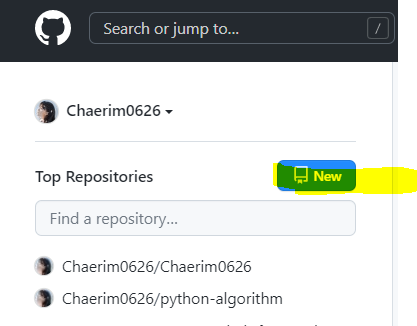
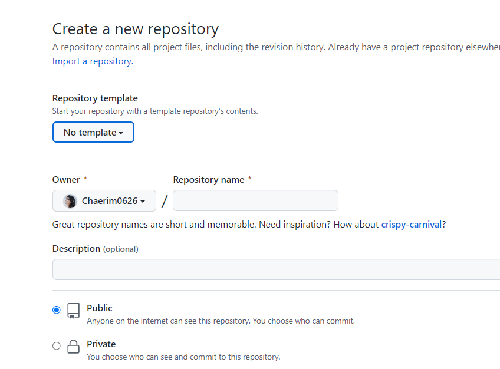
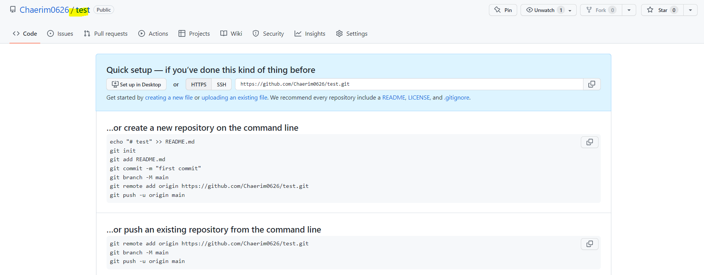
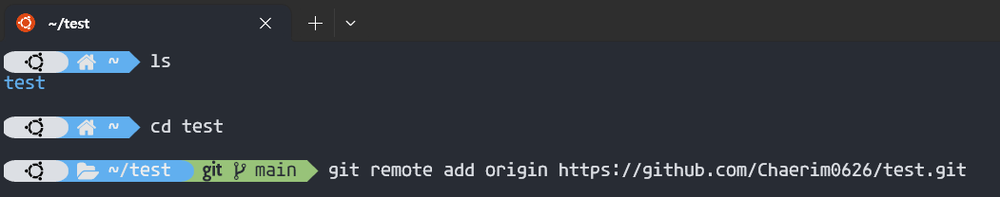
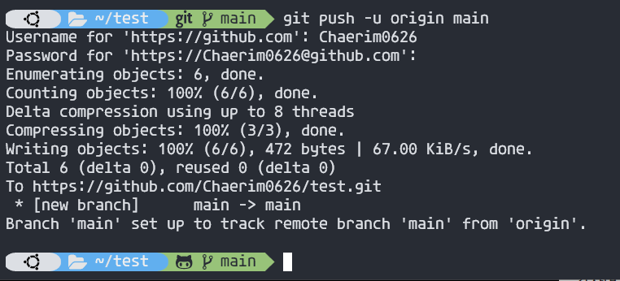
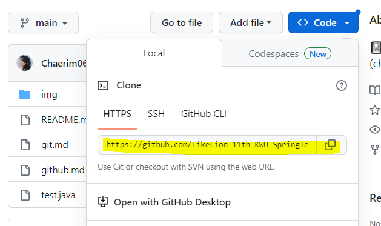
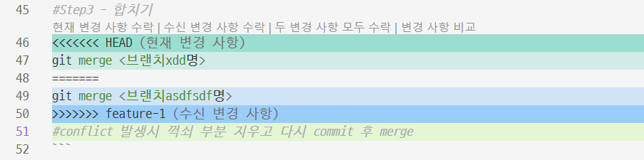
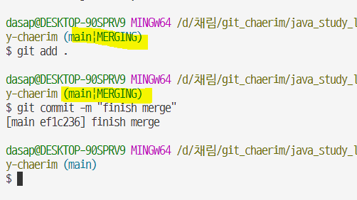

# git-study-chaerim

📓LikeLion KWU git study (chaerim) <br>
모든 개발의 기본인 <strong>git, github 강의</strong> 내용정리 입니다.

<hr>
<br>

## 1. Github에 소스 반영

```bash
#Step1 - 로컬 저장소의 프로젝트를 원격 저장소에 반영
#origin과 원격저장소 주소를 매칭!
git remote add origin <원격저장소 주소>

#Step2 -
git push -u origin main
#main브랜치를 origin에 push한다. u옵션을 주면 브랜치맵핑을 계속하려는 옵션으로 나중에 git push만 써도 올릴 수 있다.
#push하면 처음에는 계정정보 인증하고 사용하자.

```

<br>

## 2. Github에 소스 반영 실습

1. 원격저장소 주소 생성을 위해 Github에서 새로운 저장소 만들기

   
   
   

2. 내 로컬저장소와 원격저장소 주소 연결하기
   
3. main브랜치에 로컬 브랜치 내용 push하기 (이 때 Github 인증창 뜨면 인증하기, 비번엔 token입력)
   

<br>

## 3. Github으로 협업하기

```bash
#Step1 - 원격저장소에서 내컴으로 가져오기
git clone <원격저장소주소>

#Step2 - 브랜치 설정
git checkout -b <브랜치명> #생성하며 이동
git checkout <브랜치명> #이동
git branch #해당 브랜치 목록 확인

#Step3 - 합치기
git merge <브랜치명>
#conflict 발생시 꺽쇠 부분 지우고 다시 commit 후 merge
```

<br>

## 4. Github으로 협업하기 실습






<br>

## 5. Git GUI 활용하기

- 그래픽 유저 인터페이스 활용
- git fork 프로그램 활용
- vscode에선 gitLens 설치
